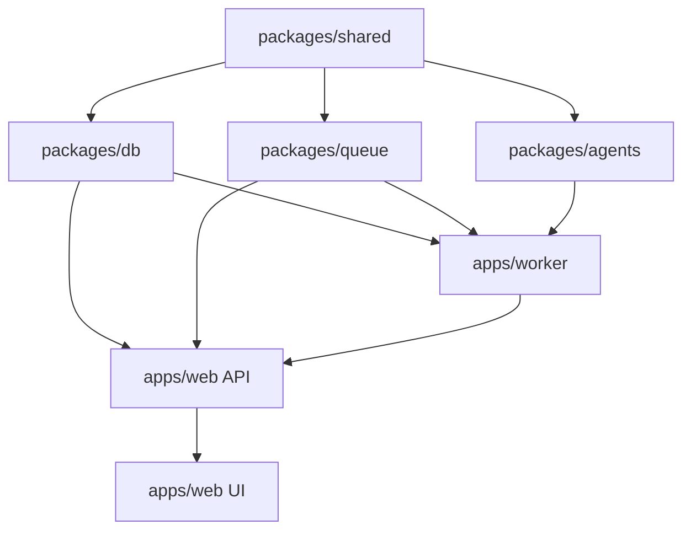

# AIGC CEO Marketing — 开发 Workflow

**solo + Cursor** 场景下的分段式开发流程：从 Plan 到上线，按依赖顺序拆模块，避免返工。

> 产品业务流程见 [WORKFLOW.md](./WORKFLOW.md)（用户操作分段）  
> 规划 Prompt 见 [PLAN_PROMPT.md](./PLAN_PROMPT.md)

---

## 总览：开发六段

```
┌─────────┐   ┌─────────┐   ┌─────────┐   ┌─────────┐   ┌─────────┐   ┌─────────┐
│  Dev 1  │ → │  Dev 2  │ → │  Dev 3  │ → │  Dev 4  │ → │  Dev 5  │ → │  Dev 6  │
│ 规划    │   │ 地基    │   │ 流水线  │   │ 体验层  │   │ 联调    │   │ 部署    │
│ Plan    │   │ Infra   │   │ Pipeline│   │ UI/Portal│  │ E2E     │   │ Ship    │
└─────────┘   └─────────┘   └─────────┘   └─────────┘   └─────────┘   └─────────┘
  1-2 天        1-2 周        2-3 周        1-2 周        3-5 天        2-3 天
```

| 段 | 目标 | 可演示能力 |
|----|------|------------|
| **Dev 1** | 计划冻结、目录约定 | 无代码或空 monorepo |
| **Dev 2** | DB / Auth / 上传 / 租户 | 登录 + 建 Workspace + 传文件 |
| **Dev 3** | CEO + Worker 跑通 | 上传 → 出成片（可无 UI） |
| **Dev 4** | 控制台 + 审核 + Portal | 完整人机闭环 |
| **Dev 5** | E2E、隔离、限流 | 2 Workspace 不串数据 |
| **Dev 6** | 预发/生产、试点 | 代运营客户可试用 |

**原则：** 每段结束有一个 **可运行、可演示** 的里程碑；不跨段堆功能。

---

## 日常开发循环（Daily Loop）

每天按此循环，用 Cursor Agent 效率最高：

```
1. 读 WORKFLOW 当前段「本段任务」→ 明确今天 1-3 个 deliverable
2. Ask 模式：卡住时查架构/成本，不直接改代码
3. Agent 模式：按 .cursor/rules 让 Agent scaffold / 改单模块
4. 本地验证：pnpm dev + pnpm worker:dev + 手动走 API/UI
5. 提交：一个 deliverable 一个 commit（功能完整再 commit）
6. 更新段末检查清单
```

### Cursor 使用分工

| 模式 | 用途 |
|------|------|
| **Plan** | Dev 1、大模块开工前、架构变更前 |
| **Ask** | 读代码、对 API schema、排错分析 |
| **Agent** | scaffold、实现接口、写 Agent prompt、FFmpeg 脚本 |

### Agent 前必做

1. 在 prompt 里写明 **当前 Dev 段编号** 和 **不要做的范围**
2. 引用 `.cursor/rules`（多租户 `workspace_id`、API 约定）
3. 一次只让 Agent 改 **一个 package 或一条竖切链路**

---

## Dev 1：规划（Plan）

**时长：** 1–2 天  
**产出：** 冻结的 Phase 1 范围 + 空仓库或计划文档

### 步骤

| 步 | 动作 | 工具 |
|----|------|------|
| 1.1 | 复制 `PLAN_PROMPT.md` 全文到 Cursor Plan | Plan 模式 |
| 1.2 | 审阅输出的 Schema / API / 16 周拆解 | 人工 |
| 1.3 | 确认技术选型：**Drizzle + Supabase + BullMQ + FFmpeg** | ADR 记下来 |
| 1.4 | 明确 Phase 1 **不做** 清单（计费、自动发布等） | README 已有 |
| 1.5 | Plan 确认后切 Agent：`从 Dev 2 开始 scaffold monorepo` | Agent |

### 段末检查

- [ ] DB 表清单与关系已定
- [ ] API 列表与 auth 规则已定
- [ ] Agent input/output JSON schema 已定
- [ ] FFmpeg 输入 JSON 格式已定

### 不要在此段写

业务 UI 美化、Stripe、平台 OAuth、Remotion

---

## Dev 2：地基（Infra & Foundation）

**时长：** 约 1–2 周  
**目标：** 能登录、建租户、传文件；**还不跑 CEO**

### 开发顺序（严格按依赖）

```
2.1 Monorepo scaffold
  → 2.2 packages/shared（types, platform specs）
  → 2.3 packages/db（schema + migrations）
  → 2.4 Supabase Auth 接入
  → 2.5 packages/queue（job 类型定义，可先 mock consumer）
  → 2.6 apps/web API：workspaces / campaigns / assets 上传
  → 2.7 apps/web 最小 UI：登录 + Workspace 列表 + Campaign 创建 + 上传页
```

### 2.1 Monorepo scaffold

```bash
# Agent 应创建的结构
ceo-agent/
├── apps/web/
├── apps/worker/
├── packages/{agents,db,queue,shared}/
├── .cursor/rules/
├── pnpm-workspace.yaml
├── package.json
├── .env.example
└── turbo.json（可选）
```

**Deliverable：** `pnpm install` 成功，空 Next.js 能 `pnpm dev`

### 2.2 packages/shared

- `Platform` enum：`douyin | xiaohongshu | tiktok`
- `CampaignGoal`、`TaskStatus`、`ReviewDecision` 等
- 平台规格常量（标题长度、比例 9:16）

### 2.3 packages/db

**先做表（顺序）：**

```
organizations → workspaces → workspace_members
→ campaigns → assets
→ tasks → creatives → reviews
→ client_invites → publish_jobs → usage_records
```

**规则：** 每张业务表 `org_id` + `workspace_id`；写 query helper 强制 filter。

**Deliverable：** `pnpm db:push` 成功，Supabase 可见表

### 2.4 Auth

- Supabase Auth（email magic link 或 OAuth）
- Middleware：解析 session → 注入 `org_id`
- RBAC 中间件骨架（按 `workspace_members.role`）

### 2.5 packages/queue

```typescript
// Job 类型先定义，worker 可后接
type JobName =
  | 'ceo:run-task'
  | 'ffmpeg:render'
  | 'export:pack';
```

### 2.6 API（Dev 2 范围）

| 优先级 | Endpoint | 说明 |
|--------|----------|------|
| P0 | `POST/GET /api/workspaces` | 租户 |
| P0 | `POST /api/campaigns` | 立项 |
| P0 | `POST /api/campaigns/:id/assets` | presigned 上传 |
| P0 | `GET /api/campaigns/:id` | 详情 |
| P1 | `POST /api/workspaces/:id/invites` | 可先 stub |

### 2.7 最小 UI

| 路由 | 页面 |
|------|------|
| `/login` | 登录 |
| `/workspaces` | 列表 |
| `/workspaces/[id]/campaigns/new` | 创建 + 上传 |
| `/campaigns/[id]` | 详情（仅显示 assets，无 CEO 按钮或 disabled） |

### Dev 2 段末演示

```
登录 → 创建 Workspace → 创建 Campaign → 上传 mp4 → 刷新可见 asset 列表
```

### 段末检查

- [ ] 2 个 Workspace 数据互不可见
- [ ] 上传文件路径含 `workspace_id`
- [ ] `.env.example` 齐全
- [ ] `.cursor/rules` 含多租户约定

---

## Dev 3：流水线（CEO Pipeline）

**时长：** 约 2–3 周  
**目标：** `POST run` → Worker 执行 → DB 里出现 `creative` 与视频 URL  
**可先无漂亮 UI**，用 API / 脚本验证

### 开发顺序

```
3.1 packages/agents（纯函数 + LLM 调用，无队列）
  → 3.2 CEO Orchestrator 状态机
  → 3.3 apps/worker processor（消费 ceo:run-task）
  → 3.4 FFmpeg 渲染脚本（本地 CLI 先跑通）
  → 3.5 串联：enqueue → worker → 写 creatives
  → 3.6 POST /api/campaigns/:id/run + GET /api/tasks/:id
  → 3.7 LLM gateway（预算、重试、日志）
```

### 3.1 Agents 实现顺序

| 顺序 | Agent | 可先 mock |
|------|-------|-----------|
| 1 | Copy | 用固定 JSON 测下游 |
| 2 | Vision | 用文本描述 mock |
| 3 | Edit Director | 固定 timeline |
| 4 | Compliance | 规则引擎即可 |
| 5 | CEO Orchestrator | 串联 + 重试 |
| 6 | Publish | 仅返回 metadata |

**每个 Agent：** 独立文件 + Zod schema + 单元测试（mock LLM）

### 3.2 CEO 状态机（worker 内）

```
parse_intent → plan → [vision ∥ copy] → edit → enqueue ffmpeg
→ compliance → score → save creative | retry
```

### 3.3 FFmpeg

- 输入：`EditTimelineJSON`（见 Plan）
- 输出：720p mp4 + jpg 封面
- 本地：`apps/worker/ffmpeg/render.ts` + 测试 fixture

### 3.4 API

| Endpoint | 说明 |
|----------|------|
| `POST /api/campaigns/:id/run` | 创建 task，enqueue |
| `GET /api/tasks/:id` | `steps[]` 进度 |
| `POST /api/tasks/:id/retry` | 指定 agent 重跑 |

### Dev 3 段末演示

```bash
# 用 curl 或 REST Client
POST /api/campaigns/{id}/run
# 轮询 GET /api/tasks/{id} 直到 completed
# creatives 表有 video_url + copy_variants
```

### 段末检查

- [ ] 单条测试视频端到端 < 15 分钟
- [ ] CEO retry ≤ 2 次生效
- [ ] LLM 单次 task 有 cost 日志
- [ ] Worker 崩溃可重新消费 job（幂等）

---

## Dev 4：体验层（UI + Review + Portal）

**时长：** 约 1–2 周  
**目标：** 运营能在浏览器里完成段 1–6 产品流程（导出可先）

### 开发顺序

```
4.1 Task 进度页（轮询 / SSE）
  → 4.2 Creative 预览页（视频 + 文案 tab）
  → 4.3 PATCH copy + 触发局部 retry
  → 4.4 Review 队列 + decide API 接线
  → 4.5 Client Portal /portal/[token]
  → 4.6 Export ZIP
  → 4.7 Campaign 详情页「运行 CEO」按钮启用
```

### 4.5 Client Portal 要点

- `GET /api/portal/:token`：校验过期、绑定单个 `creative_id`
- 无登录；只读 + `POST decide`
- 极简 UI：播放器 + 文案 + 通过/驳回 + 评论

### 4.6 Export

- Worker job `export:pack`
- ZIP：video.mp4 + cover.jpg + copy.txt + tags.json

### Dev 4 段末演示

```
完整浏览器路径：
登录 → Campaign → 上传 → 运行 CEO → 看进度 → 预览 → 改文案
→ 内部审核通过 →（代运营）发 Portal 链接 → 客户通过 → 下载 ZIP
```

### 段末检查

- [ ] 8 个 Phase 1 页面路由齐全
- [ ] reject 后回到可编辑状态
- [ ] Portal token 过期返回 403

---

## Dev 5：联调与硬化（Hardening）

**时长：** 3–5 天  
**目标：** 可给第一个代运营试点用，不易炸

### 任务清单

| 项 | 做法 |
|----|------|
| **租户隔离 E2E** | 自动化：Workspace A 不能 GET B 的 campaign |
| **错误处理** | Task `failed` 可读错误信息；UI toast |
| **限流** | API rate limit；LLM `LLM_BUDGET_PER_TASK_USD` |
| **日志** | 每个 Agent step 写 `task_steps` 表或 JSON 日志 |
| **幂等** | 重复 `run` 防双任务（campaign 级 lock） |
| **种子数据** | `pnpm db:seed` 测试账号 + _sample 视频 |
| **README** | 本地启动步骤实测可跟 |

### 建议测试矩阵

| 用例 | 预期 |
|------|------|
| 竖版 30s mp4 | 9:16 成片 |
| 3 张产品图 | 走图片路径（若 MVP 支持）或报错友好 |
| 内部 reject | 可改稿再提交 |
| 客户 reject | Portal comment 出现在运营侧 |
| 超预算 LLM | Task failed，明确提示 |

---

## Dev 6：部署（Ship）

**时长：** 2–3 天

### 部署顺序

```
6.1 Supabase 生产项目 + migration
  → 6.2 Upstash Redis 生产
  → 6.3 OSS / Supabase Storage bucket + CORS
  → 6.4 Vercel 部署 apps/web
  → 6.5 Railway/Fly 部署 apps/worker（含 FFmpeg 镜像）
  → 6.6 环境变量与 webhook（如有）
  → 6.7 烟雾测试生产 URL
```

### Worker Docker 要点

```dockerfile
# infra/docker/Dockerfile.worker
FROM node:20-bookworm
RUN apt-get update && apt-get install -y ffmpeg
# ... copy worker, pnpm install, CMD node dist/index.js
```

### 环境分离

| 环境 | 用途 |
|------|------|
| `local` | 开发，本地 Redis 或 Upstash dev |
| `staging` | 自用 dogfood |
| `production` | 试点客户 |

### Dev 6 段末检查

- [ ] 生产环境完整跑通 1 条 Campaign
- [ ] Worker 日志可查看（Railway/Fly logs）
- [ ] 密钥不在 repo 内

---

## Git / 分支 Workflow（solo 简化版）

```
main          ← 可部署、稳定
  └── dev     ← 日常开发（可选，solo 可直接 main）
```

**Commit 规范（建议）：**

```
feat(web): workspace list page
feat(db): add creatives table
feat(agents): copy agent with zod schema
feat(worker): ffmpeg render pipeline
fix(api): enforce workspace_id on campaign get
```

**规则：**

- 一个 deliverable 一个 commit
- 不提交 `.env.local`
- 大功能先在分支 `feat/ceo-pipeline`，测通再 merge

---

## 竖切 vs 横切（怎么拆 Cursor 任务）

### 推荐：竖切（按用户故事）

```
「运营能上传并触发 CEO」= db + api + queue + worker + 一个按钮
```

每次 Agent 任务描述模板：

```markdown
## 当前段：Dev 3
## 竖切目标：POST /campaigns/:id/run 触发 worker 并完成 copy agent
## 范围：packages/agents/copy.ts, apps/worker/processors/ceo.ts, apps/web/api/.../run
## 不要改：UI 样式、Portal、Stripe
## 验收：curl run 后 tasks 表 status=completed
```

### 避免：横切（先写完全部 API 再写全部 UI）

容易接口与真实需求对不上，联调返工多。

---

## 16 周对照（与 PLAN 对齐）

| 周 | Dev 段 | 重点 |
|----|--------|------|
| W1 | Dev 1–2 | Plan + monorepo + schema |
| W2 | Dev 2 | Auth + workspace + upload API/UI |
| W3 | Dev 3 | Copy + Vision agent |
| W4 | Dev 3 | CEO orchestrator |
| W5 | Dev 3 | FFmpeg worker |
| W6 | Dev 3 | run API 端到端 |
| W7 | Dev 4 | Task 进度 + Creative 预览 |
| W8 | Dev 4 | 改文案 + retry |
| W9 | Dev 4 | Review 流 |
| W10 | Dev 4 | Client Portal |
| W11 | Dev 4 | Export ZIP |
| W12 | Dev 5 | E2E + 隔离测试 |
| W13 | Dev 5 | 限流 + 错误处理 |
| W14 | Dev 6 | Staging 部署 |
| W15 | Dev 6 | Production + 试点 |
| W16 | 缓冲 | Bugfix + 文档 |

---

## 模块依赖图（开发时看）



**规则：** 箭头左侧未完成时，不要写右侧业务逻辑。

---

## 给 Cursor Agent 的段内 Prompt 片段

### 开始 Dev 2

```
当前开发段：Dev 2 地基。
请 scaffold pnpm monorepo，创建 apps/web (Next.js 14 App Router)、
packages/db (Drizzle + Supabase)、packages/shared。
实现 organizations/workspaces/campaigns/assets 表与 POST/GET workspaces、
POST campaigns、presigned upload。
不要实现 CEO、Worker、Review UI。
验收：pnpm dev 可登录并上传文件。
```

### 开始 Dev 3

```
当前开发段：Dev 3 流水线。
在现有 monorepo 上实现 packages/agents（CEO/Copy/Vision/Edit/Compliance）、
apps/worker BullMQ consumer、FFmpeg 渲染。
实现 POST /api/campaigns/:id/run 与 GET /api/tasks/:id。
不要写 Portal 和 Export。
验收：上传测试 mp4 后 run，DB 有 creative.video_url。
```

### 开始 Dev 4

```
当前开发段：Dev 4 体验层。
实现 Task 进度页、Creative 预览、PATCH copy、Review decide、
/portal/[token]、export ZIP。
不要加 Stripe 和平台 OAuth。
验收：README 完整用户路径可在浏览器走通。
```

---

## 常见问题（开发排障顺序）

| 现象 | 查什么 |
|------|--------|
| run 无反应 | Redis 连接 → queue enqueue 日志 → worker 是否启动 |
| Task 一直 processing | worker logs → LLM API key → job 是否 throw |
| 视频黑屏 | FFmpeg 命令 stderr → timeline JSON → 源文件 codec |
| 串租户数据 | API 是否每条 query 带 workspace_id |
| Portal 403 | token 过期 / creative_id 不匹配 |

---

## 相关文件

| 文件 | 内容 |
|------|------|
| [README.md](./README.md) | 产品说明、架构、API 表 |
| [WORKFLOW.md](./WORKFLOW.md) | **产品**分段业务流程（非开发） |
| [PLAN_PROMPT.md](./PLAN_PROMPT.md) | Plan 模式完整输入 |
