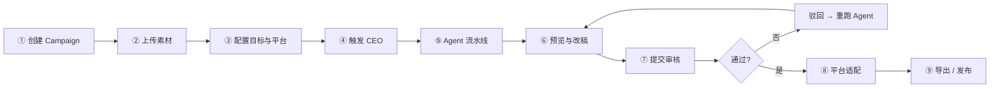
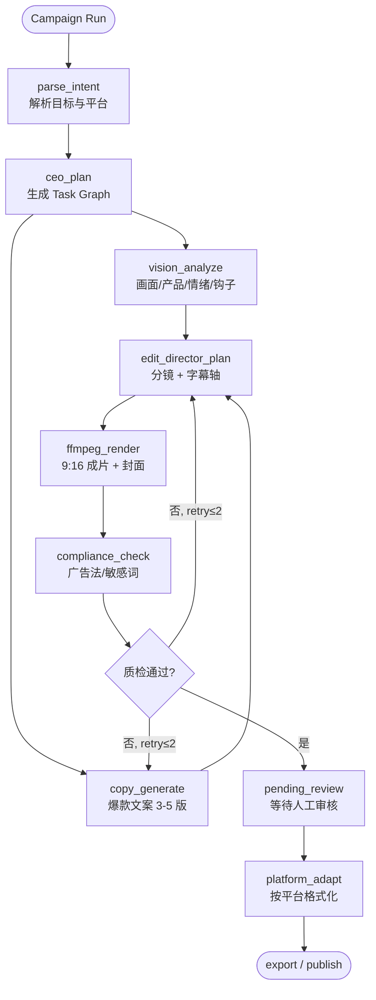
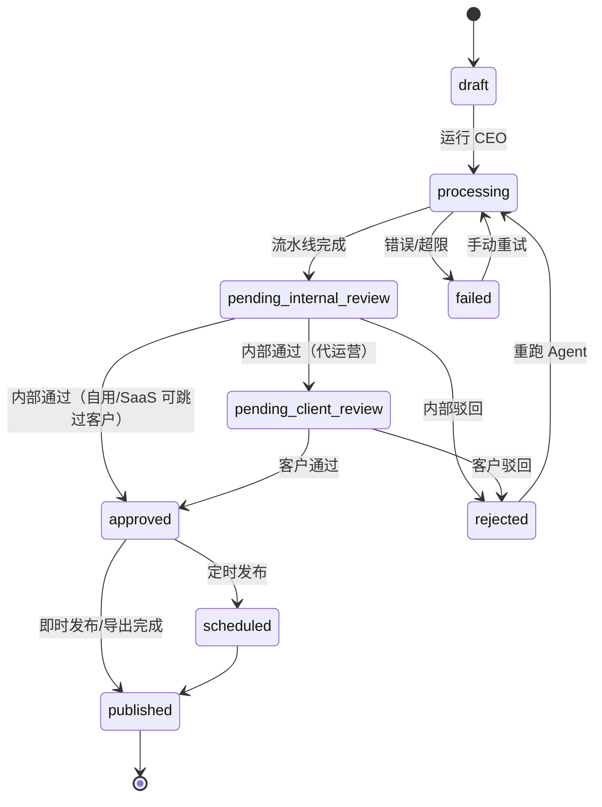
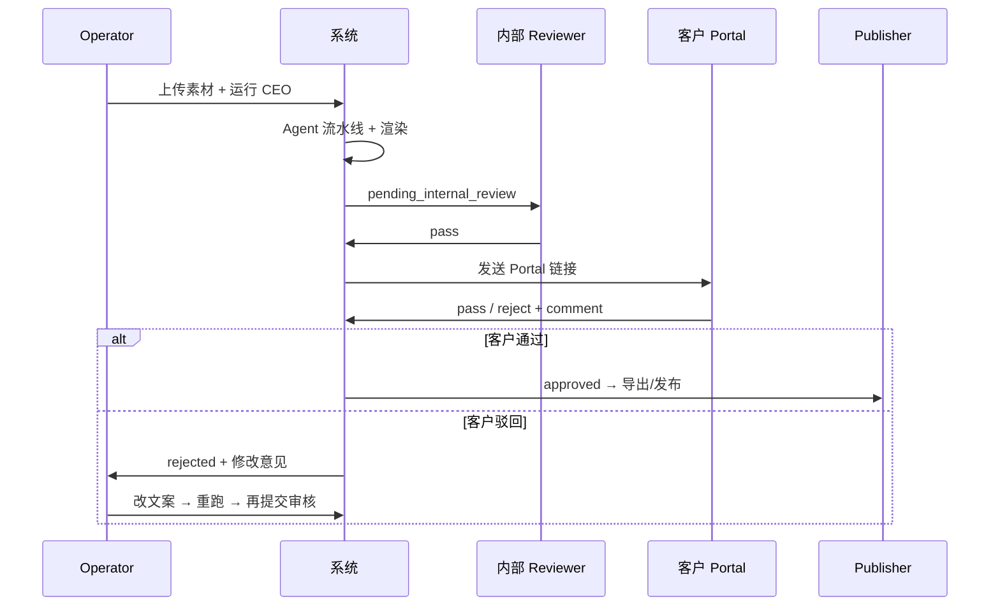
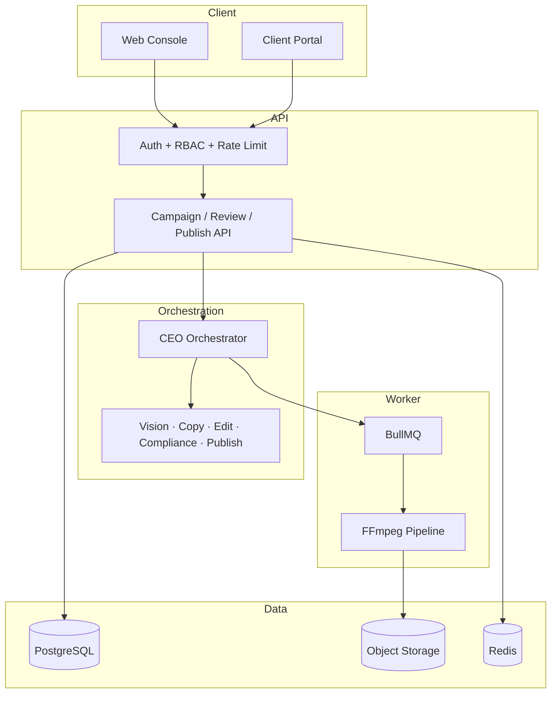

# EmberOS — AIGC CEO for Marketing

**EmberSoul Labs** · 上传素材 → CEO Agent 编排 → 爆款文案 + 剪辑成片 + 平台适配 → 审核 → 导出/发布

面向 **自用 / 代运营 / SaaS** 三合一的 AIGC 营销流水线。用户上传视频或图片，由 **CEO Orchestrator** 调度多模态子 Agent，自动产出可发布的短视频与配套文案，经人工或客户审核后导出或发布到社交平台。

**生产环境：** [emberos-iota.vercel.app](https://emberos-iota.vercel.app) · **法律文档：** [Terms](https://embersoullabs.com/terms/) · [Privacy (PDPA)](https://embersoullabs.com/privacy/)

---

## 目录

- [产品定位](#产品定位)
- [三种使用模式](#三种使用模式)
- [端到端 Workflow](#端到端-workflow)
- [角色与操作路径](#角色与操作路径)
- [CEO 任务流水线](#ceo-任务流水线)
- [审核状态机](#审核状态机)
- [系统架构](#系统架构)
- [数据模型](#数据模型)
- [技术栈](#技术栈)
- [项目结构](#项目结构)
- [本地开发](#本地开发)
- [生产与 CI](#生产与-ci)
- [环境变量](#环境变量)
- [API 概览](#api-概览)
- [路线图](#路线图)
- [成本与安全](#成本与安全)

---

## 产品定位

| 能力 | 说明 |
|------|------|
| **CEO Agent** | 理解营销目标，拆解任务，调度子 Agent，质检与重试 |
| **爆款文案** | 按平台（抖音/小红书/TikTok）生成多版标题、正文、标签 |
| **智能剪辑** | FFmpeg 裁切 9:16、字幕、封面、基础节奏 |
| **多租户** | Organization → Workspace → Campaign，代运营多客户隔离 |
| **审核闭环** | 内部 QC + 客户 Portal（scoped token，无需登录） |
| **导出/发布** | Phase 1 导出成片+文案包；Phase 1.5+ 对接平台 API |

**Phase 1 目标：** 上传后 **10 分钟内** 产出 1 条 9:16 成片 + 3 套文案，支持代运营客户审片。

---

## 三种使用模式

```
┌─────────────────────────────────────────────────────────────┐
│                    统一 CEO 引擎（同一套流水线）              │
└─────────────────────────────────────────────────────────────┘
         ▲                    ▲                    ▲
         │                    │                    │
   ┌─────┴─────┐        ┌─────┴─────┐        ┌─────┴─────┐
   │   自用     │        │  代运营    │        │   SaaS    │
   │ 自有品牌   │        │ 多甲方客户 │        │ 租户自助   │
   └───────────┘        └─────┬─────┘        └───────────┘
                              │
                        ┌─────┴─────┐
                        │  Client   │
                        │  Portal   │
                        └───────────┘
```

| 模式 | 谁在用 | Workspace 含义 | 审核链 |
|------|--------|----------------|--------|
| **自用** | 你们自己的品牌 | 品牌 A / 品牌 B | 内部同事审核 → 发布 |
| **代运营** | 你们团队 + 甲方 | 每个客户 1 个 Workspace | 内部 QC → **客户 Portal** → 发布 |
| **SaaS** | 外部付费租户 | 租户自建多个品牌 | 租户内可选审核 → 发布 |

---

## 端到端 Workflow

### 总览



### 详细步骤

#### ① 创建 Campaign

运营在指定 **Workspace** 下新建营销活动，填写：

- **目标**：涨粉 / 带货 / 种草 / 品牌曝光
- **平台**：`douyin` | `xiaohongshu` | `tiktok` | `wechat_channels`
- **品牌配置**（可选）：调性、禁用词、目标人群、CTA

#### ② 上传素材

支持：

| 类型 | 格式 | 说明 |
|------|------|------|
| 视频 | mp4, mov | 原片、口播、产品展示 |
| 图片 | jpg, png, webp | 产品图、海报（≥1 张，推荐 3 张） |
| 参考 | URL / 文本 | 爆款参考链接、品牌手册摘要 |

素材写入 Object Storage，路径：`{workspace_id}/campaigns/{campaign_id}/assets/`

#### ③ 配置并启动

用户确认平台规格后点击 **「运行 CEO」**：

- API 创建 `Task`，状态 `draft` → `processing`
- 任务入队 BullMQ，Worker 开始执行 CEO Task Graph

#### ④⑤ CEO + 子 Agent 流水线

见 [CEO 任务流水线](#ceo-任务流水线)。

产出：

- **Creative**：1 条成片（9:16）+ 3–5 套文案变体 + 封面
- 状态进入 `pending_internal_review`

#### ⑥ 预览与改稿

运营在 Creative 预览页：

- 播放成片、切换文案版本
- 直接编辑标题/正文/标签
- 保存后可选 **仅重跑 Copy** 或 **重跑剪辑**

#### ⑦ 审核

| 场景 | 流程 |
|------|------|
| 自用 | Operator 提交 → Reviewer 内部审核 |
| 代运营 | 内部 QC 通过 → 生成 **Client Portal** 链接 → 客户审片 |
| SaaS | 可配置是否跳过客户审核 |

客户通过 **Client Portal** 链接打开审片页，无需登录，仅可查看 token 绑定的 Creative 并 pass/reject/comment。

#### ⑧ 平台适配

Publish Agent 按目标平台格式化：

| 平台 | 适配项 |
|------|--------|
| 抖音 | 标题 ≤30 字、口语化、话题标签 |
| 小红书 | 标题 emoji、分段正文、标签 |
| TikTok | 英文/双语、hashtags、时长 ≤60s |

#### ⑨ 导出 / 发布

**Phase 1（当前）：**

- 下载 ZIP：成片 mp4 + 封面 + 文案 txt + 标签列表
- 运营手动上传到平台

**Phase 1.5+：**

- 绑定平台账号 OAuth
- 定时发布 / 即时发布
- 发布状态回写 `publish_jobs`

---

## 角色与操作路径

### 角色权限（RBAC）

| 角色 | 上传 | 运行 CEO | 改文案 | 内部审核 | 客户审核 | 发布/导出 |
|------|:----:|:--------:|:------:|:--------:|:--------:|:---------:|
| Workspace Admin | ✓ | ✓ | ✓ | ✓ | — | ✓ |
| Operator | ✓ | ✓ | ✓ | 提交 | — | ✓ |
| Editor | ✓ | — | ✓ | — | — | — |
| Reviewer | — | — | — | ✓ | — | — |
| Publisher | — | — | — | — | — | ✓ |
| Client Viewer | — | — | — | — | ✓ | — |

### 路径 A：自用品牌（最快闭环）

```
登录 → 选择 Workspace（自有品牌）
  → 新建 Campaign → 上传视频
  → 选「带货 + 抖音」→ 运行 CEO
  → 等待 ~10min → 预览 Creative
  → 微调文案 → 内部审核通过
  → 导出 ZIP → 手动发抖音
```

### 路径 B：代运营（核心商业路径）

```
登录 → Workspace 看板（客户 A / B / C）
  → 进入客户 A → 新建 Campaign
  → 上传客户素材 → 运行 CEO
  → 内部 QC 预览 → 修改 → 通过内部审核
  → 生成 Client Portal 链接 → 发给客户微信/邮件
  → 客户打开链接 → 审片 pass/reject
  → 若 reject：运营改稿 → 重新提交客户审
  → 若 pass：导出或发布到客户账号
```

### 路径 C：SaaS 租户（Phase 2）

```
自助注册 → 创建 Organization → 创建 Workspace
  → 同上路径 A → 套餐用量扣减 → 超限提示升级
```

---

## CEO 任务流水线

### Task Graph



### 子 Agent 职责

| Agent | 输入 | 输出 |
|-------|------|------|
| **CEO Orchestrator** | goal, platforms, assets, brand_profile | TaskGraph JSON、调度、重试、成本预算 |
| **Vision** | 素材 URL、抽帧 | subjects, scenes, hooks[], transcript? |
| **Copy** | vision 摘要、平台、目标 | variants[]: title, hook, body, cta, tags |
| **Edit Director** | vision + copy + 时长 | timeline[], cover_text, bgm? |
| **Compliance** | 文案 + 字幕 | passed, flags[] |
| **Publish** | 已审核 creative | export_pack_url 或 publish_job |

### 爆款文案结构（Copy Agent）

每版文案遵循「收缩」骨架：

```
[0-3s 钩子]  疑问 / 反差 / 数字
[中间价值]   ≤3 个卖点
[结尾 CTA]   关注 / 下单 / 私信
```

模板类型：痛点型 | 对比型 | 清单型 | 故事型 | 测评型

### 并行与重试

- `vision_analyze` 与 `copy_generate` 在 CEO 规划后可 **并行**（copy 可先基于元数据草稿，vision 完成后 refine）
- 合规失败或质检低分：CEO 决定重跑 Copy 或 Edit，**上限 2 次**
- 人工驳回：仅重跑被点名的 Agent，不整链重跑

---

## 审核状态机

### Creative / Task 状态



### 代运营审核时序



---

## 系统架构



### 部署

| 组件 | 部署位置 | 状态 |
|------|----------|------|
| Next.js Web + API | Vercel | ✅ [emberos-iota.vercel.app](https://emberos-iota.vercel.app) |
| Worker + FFmpeg | Railway / Fly.io / VPS | 🔄 需确认生产 Worker 在线 |
| PostgreSQL + Auth | Supabase | ✅ |
| Redis 队列 | Upstash | ✅ |
| 视频/图片文件 | Supabase Storage | ✅ |

---

## 数据模型

```
Organization
  └── Workspace（隔离边界）
        ├── brand_profile（调性、禁用词）
        ├── workspace_members（角色）
        └── Campaign
              ├── Asset（video | image）
              ├── Task（CEO 执行单元）
              │     └── ceo_plan JSON
              └── Creative
                    ├── copy_variants[]
                    ├── video_url, cover_url
                    ├── Review[]（internal | client）
                    └── PublishJob[]（per platform）
```

**强制规则：** 所有业务表含 `org_id` + `workspace_id`，所有查询必须带 workspace 过滤。

---

## 技术栈

| 层 | 技术 |
|----|------|
| 前端 | Next.js 14+ App Router, TypeScript, Tailwind |
| 后端 API | Next.js Route Handlers |
| 数据库 | Supabase PostgreSQL + Drizzle ORM |
| 认证 | Supabase Auth |
| 队列 | BullMQ + Upstash Redis |
| Agent | OpenAI SDK + 自研状态机 |
| 视频 | FFmpeg（Worker 内 CLI） |
| 存储 | Supabase Storage / S3 |
| 部署 | Vercel + Railway |

---

## 项目结构

```
ceo-agent/
├── apps/
│   ├── web/                    # Next.js：控制台 + Client Portal + API
│   │   ├── app/
│   │   │   ├── (auth)/         # 登录
│   │   │   ├── workspaces/     # 代运营看板
│   │   │   ├── campaigns/      # 创建 / 详情 / 进度
│   │   │   ├── creatives/      # 预览 / 改稿
│   │   │   ├── reviews/        # 审核队列
│   │   │   ├── portal/[token]/ # 客户审片（无登录）
│   │   │   └── api/            # REST API
│   │   └── components/
│   └── worker/                 # BullMQ consumer + FFmpeg
│       ├── processors/
│       └── ffmpeg/
├── packages/
│   ├── agents/                 # CEO, Vision, Copy, Edit, Compliance, Publish
│   ├── db/                     # Schema, migrations, queries
│   ├── queue/                  # Job types, enqueue helpers
│   └── shared/                 # Types, platform specs, constants
├── .cursor/rules/              # Cursor Agent 开发约定
├── infra/docker/               # Worker 镜像（含 FFmpeg）
├── PLAN_PROMPT.md              # Cursor Plan 模式 Prompt
└── README.md
```

---

## 本地开发

> Monorepo scaffold 与 M1–M3 功能已完成。按以下步骤配置环境并启动。

### 前置要求

- Node.js 20+
- pnpm 9.15+（见根目录 `packageManager`）
- FFmpeg（Worker 本地调试，加入 PATH）
- Supabase 项目（Postgres + Auth + Storage）
- Redis（本地或 Upstash）
- OpenAI API Key

### 安装

```bash
git clone https://github.com/EmbersoulLabs/EmberOS.git
cd EmberOS
pnpm install
cp .env.example .env.local
# 编辑 .env.local 填入 Supabase、Redis、OpenAI 密钥
pnpm dev:sync   # 同步到 apps/web 与 apps/worker
```

### 数据库

```bash
pnpm db:push          # 推送 schema 到 Supabase
pnpm db:rls           # 启用多租户 RLS（可重复执行，幂等）
# 或
pnpm db:migrate       # 运行 migrations
```

### 启动

```bash
# 推荐：Web + Worker 一起启动（会先 dev:sync）
pnpm dev

# 或分开两个终端
pnpm dev            # Web
pnpm worker:dev     # Worker
```

访问：`http://localhost:3000`（注册须勾选 [Terms](https://embersoullabs.com/terms/) 与 [Privacy](https://embersoullabs.com/privacy/)）

### 快速验证流程

1. 注册/登录 → 创建 Workspace
2. 新建 Campaign → 上传测试 mp4
3. 选择平台 + 目标 → 点击「运行 CEO」
4. 在 Task 页查看进度 → Creative 预览（Auto Clip 默认 3 条 clip）
5. 内部审核通过 → 导出 ZIP

### 常用命令

```bash
pnpm verify                              # test + typecheck + web build（与 CI 一致）
pnpm check:infra                         # DATABASE_URL + REDIS_URL + OpenAI 连通性
pnpm smoke:prod -- --url http://localhost:3000
pnpm e2e:video-studio -- --list          # 列出有视频的 Campaign
pnpm e2e:video-studio -- --run <id>      # 完整 Auto Clip E2E（需 Worker 在线）
```

---

## 生产与 CI

### GitHub Actions

推送 `main` 触发 [`.github/workflows/ci.yml`](./.github/workflows/ci.yml)：

| Job | 内容 |
|-----|------|
| **verify** | `pnpm test` → `pnpm typecheck` → web build |
| **smoke-local** | 启动 Next.js，验证 `GET /api/health` |
| **e2e-production** | 手动 `workflow_dispatch`；需配置 Secrets |

**推荐 Secrets：**

| Secret | 用途 |
|--------|------|
| `PRODUCTION_APP_URL` | 如 `https://emberos-iota.vercel.app` |
| `DATABASE_URL` / `REDIS_URL` / `OPENAI_API_KEY` | E2E 与 infra 检查 |
| `E2E_CAMPAIGN_ID` | 可选；有则跑完整 Auto Clip pipeline |

### 生产烟雾测试

```bash
pnpm smoke:prod -- --url https://emberos-iota.vercel.app --strict --infra
```

`--strict` 要求 `/api/health` 返回 `ok: true`（Supabase / DB / Redis 均已配置）。

### 共享 Upstash 时注意

本地与 Railway 共用 Redis 时，在 `.env.local` 设置 `LOCAL_DEV=true` 与 `BULLMQ_PREFIX=local`（`pnpm dev:sync` 在检测到 Upstash 时会自动写入），避免生产 Worker 抢本地任务。对生产队列跑 E2E 时使用 `E2E_PROD_QUEUE=1`。

---

## 环境变量

```bash
# App
NEXT_PUBLIC_APP_URL=http://localhost:3000

# Supabase
NEXT_PUBLIC_SUPABASE_URL=
NEXT_PUBLIC_SUPABASE_ANON_KEY=
SUPABASE_SERVICE_ROLE_KEY=
DATABASE_URL=

# Redis / Queue
REDIS_URL=

# LLM
OPENAI_API_KEY=
# 可选备用
ANTHROPIC_API_KEY=

# Storage（若不用 Supabase Storage）
S3_BUCKET=
S3_REGION=
S3_ACCESS_KEY=
S3_SECRET_KEY=

# Worker
FFMPEG_PATH=/usr/bin/ffmpeg
WORKER_CONCURRENCY=2

# 本地与生产 Redis 隔离（共用 Upstash 时）
LOCAL_DEV=true
BULLMQ_PREFIX=local

# 计费 / 导出
EXPORT_PAYWALL=false

# 成本护栏
LLM_BUDGET_PER_TASK_USD=0.50
CEO_MAX_RETRIES=2
```

---

## API 概览

| 方法 | 路径 | 说明 |
|------|------|------|
| `GET` | `/api/health` | 健康检查（env 就绪状态） |
| `GET` / `POST` | `/api/workspaces` | 列表 / 创建 Workspace |
| `GET` / `POST` | `/api/workspaces/:id` | 详情 / **生成 Client Portal 链接** |
| `GET` / `POST` | `/api/campaigns` | 列表 / 创建 Campaign |
| `GET` / `PATCH` | `/api/campaigns/:id` | Campaign 详情 / 更新 |
| `POST` | `/api/campaigns/:id/assets/upload-url` | 预签名上传 |
| `POST` | `/api/campaigns/:id/assets/:assetId/confirm` | 确认上传 |
| `POST` | `/api/campaigns/:id/run` | 触发 CEO 流水线 |
| `GET` / `POST` | `/api/tasks/:id` | 任务进度 / **重跑指定 step** |
| `GET` / `PATCH` | `/api/creatives/:id` | 预览 Creative |
| `PATCH` | `/api/creatives/:id/copy` | 修改文案 |
| `POST` | `/api/creatives/:id/submit-review` | 提交审核 |
| `POST` | `/api/reviews/:id/decide` | pass / reject |
| `GET` / `POST` | `/api/portal/:token` | 客户 Portal 数据 / 审片决定 |
| `GET` / `POST` | `/api/creatives/:id/export` | 导出 ZIP |
| `GET` / `POST` | `/api/tasks/:id/export` | 任务级多 clip 导出包 |

---

## 路线图

### Phase 1 — MVP（当前 ~75%）

- [x] 产品定义 & 架构设计
- [x] Monorepo scaffold（Web + Worker + Agents）
- [x] Vercel 生产部署 + `/api/health` smoke
- [x] 生产 Supabase RLS（`pnpm db:rls`）
- [x] Auto Clip E2E 验证（真实 Campaign，3/3 clips）
- [x] Client Portal 审片（代码已就绪）
- [x] GitHub Actions CI（test / typecheck / build / smoke）
- [x] API 限流 + 注册页 Terms/Privacy 勾选
- [x] 单元测试（RLS 覆盖、RBAC、pipeline 逻辑）
- [ ] Railway Worker 生产稳定运行（待确认）
- [ ] Stripe 订阅接入 EmberOS（账号已有，产品内待接）
- [ ] Workspace DB 级集成测试（F3）

### Phase 1.5

- [ ] 抖音 / 小红书 / TikTok OAuth 发布
- [ ] 定时发布队列
- [ ] 用量统计（`usage_records` 接线）

### Phase 2 — SaaS

- [ ] 套餐、Stripe Checkout / Customer Portal
- [ ] Agency 档（多 Workspace）
- [ ] 模板市场 / 行业 Starter

### Phase 3 — 规模化

- [ ] 数据回流（播放/转化）→ CEO 优化文案
- [ ] A/B 多版本批量渲染
- [ ] Enterprise SSO、白标

---

## 成本与安全

| 策略 | 说明 |
|------|------|
| LLM 预算上限 | 每 Task 默认 ≤ US$0.50 |
| 重试上限 | CEO 自动重试 ≤ 2 次 |
| 分辨率 | 预览 720p，导出 1080p |
| 长视频 | 先 ASR 转写，再文本规划；不全量 4K 喂 Vision |
| 租户隔离 | 存储路径 + API `requireWorkspaceRole` + DB RLS（7 张核心表） |
| Portal 安全 | Token 绑定 Creative、过期时间、rate limit |
| 合规 | Compliance Agent + 广告法敏感词库；[Privacy Policy](https://embersoullabs.com/privacy/)（MY PDPA） |

**单 Campaign 运营成本参考：** ~S$0.75（标准档）

---

## 相关文档

- [DEVELOPMENT_WORKFLOW.md](./DEVELOPMENT_WORKFLOW.md) — **开发 Workflow**（Dev 1–6 · solo + Cursor）
- [ROADMAP.md](./ROADMAP.md) — **16 周 Plan To-dos** 与完成状态
- [WORKFLOW.md](./WORKFLOW.md) — 产品分段业务流程（用户操作）
- [PLAN_PROMPT.md](./PLAN_PROMPT.md) — Cursor Plan 模式完整规划 Prompt
- [embersoullabs.com/terms](https://embersoullabs.com/terms/) · [Privacy](https://embersoullabs.com/privacy/) — 法律文档（EmberOS / Stripe / OpenAI 已覆盖）

---

## License

Private / 待定
