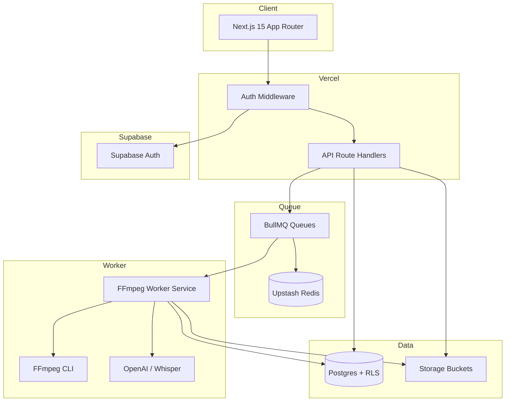

# EmberOS V1 — Backend Architecture & Implementation Plan

> **Product:** AI content OS for SMBs — long-form video → 3 short-form clips + platform captions  
> **Stack:** Next.js 15 · TypeScript · Supabase · Upstash Redis · Vercel · FFmpeg Worker · OpenAI · Whisper  
> **Status:** Production-ready architecture (V1 target)  
> **Repo alignment:** Evolves current `ceo-agent` monorepo (`apps/web`, `apps/worker`, `packages/*`)

---

## Executive Summary

EmberOS V1 is a **single-tenant-user, project-centric** pipeline:

```text
Upload (≤2GB) → compress 1080p → transcribe → analyze → 3 clips → 9:16 render + subtitles → export
```

**Design principles:**
- Supabase Auth + RLS for user data isolation
- BullMQ on Upstash Redis for durable background jobs
- FFmpeg on a dedicated Worker (not Vercel serverless)
- Credits gate expensive operations (transcribe, analyze, render)
- Raw uploads are ephemeral (7-day TTL); clips persist until user deletes

**Migration note:** Current repo uses `organizations → workspaces → campaigns → assets → tasks → creatives`. V1 introduces a **simpler domain model** (`projects → videos → clips`) while keeping Worker/Queue/FFmpeg packages. Run both models behind a `PIPELINE_MODE=auto_clip_v1` flag during transition.

---

## 1. System Architecture



### Request flow (happy path)

```text
1. POST /api/projects/:id/videos/upload-url     → presigned PUT to raw-videos
2. POST /api/projects/:id/videos/:id/confirm    → enqueue job.pipeline
3. Worker: compress → transcribe → analyze → plan 3 clips → render×3
4. GET  /api/projects/:id/videos/:id            → poll job status + clip URLs
5. POST /api/projects/:id/videos/:id/export       → ZIP (3 mp4 + captions)
```

### Deployment topology

| Component | Host | Why |
|-----------|------|-----|
| `apps/web` | Vercel | Next.js 15, edge-friendly API, presigned URLs |
| `apps/worker` | Railway / Fly.io / Render | Long-running FFmpeg, 2GB temp disk |
| Postgres + Auth + Storage | Supabase | Managed, RLS native |
| Redis | Upstash | Serverless Redis, BullMQ compatible |
| Cron (TTL cleanup) | Vercel Cron or Supabase pg_cron | Delete expired raw files |

### Service boundaries

| Layer | Responsibility | Must NOT do |
|-------|----------------|-------------|
| **API (Vercel)** | Auth, validation, credit checks, enqueue jobs, presigned URLs | FFmpeg, Whisper, long CPU |
| **Worker** | Compress, probe, transcribe, LLM analyze, render, ZIP | Direct user session auth (use service role + job payload) |
| **Supabase** | Source of truth for metadata + file storage | Business logic |
| **Redis** | Job queue + rate-limit counters | Persistent storage |

---

## 2. Database Schema

### 2.1 Enums

```sql
CREATE TYPE subscription_status AS ENUM ('trialing', 'active', 'past_due', 'canceled');
CREATE TYPE subscription_plan AS ENUM ('free', 'starter', 'pro', 'agency');
CREATE TYPE video_status AS ENUM (
  'uploaded', 'compressing', 'transcribing', 'analyzing',
  'clipping', 'rendering', 'completed', 'failed'
);
CREATE TYPE clip_status AS ENUM ('pending', 'rendering', 'ready', 'failed');
CREATE TYPE render_status AS ENUM ('queued', 'running', 'ready', 'failed');
CREATE TYPE job_status AS ENUM ('queued', 'running', 'completed', 'failed', 'canceled');
CREATE TYPE job_stage AS ENUM (
  'uploaded', 'compressing', 'transcribing', 'analyzing',
  'clipping', 'rendering', 'completed', 'failed'
);
CREATE TYPE caption_platform AS ENUM ('tiktok', 'instagram', 'facebook');
CREATE TYPE credit_tx_type AS ENUM ('grant', 'debit', 'refund', 'expire');
```

### 2.2 Tables

#### `users` (profile extension — auth in `auth.users`)

```sql
CREATE TABLE public.users (
  id            UUID PRIMARY KEY REFERENCES auth.users(id) ON DELETE CASCADE,
  email         TEXT NOT NULL,
  display_name  TEXT,
  avatar_url    TEXT,
  created_at    TIMESTAMPTZ NOT NULL DEFAULT now(),
  updated_at    TIMESTAMPTZ NOT NULL DEFAULT now()
);
CREATE INDEX users_email_idx ON public.users(email);
```

#### `subscriptions`

```sql
CREATE TABLE public.subscriptions (
  id                     UUID PRIMARY KEY DEFAULT gen_random_uuid(),
  user_id                UUID NOT NULL REFERENCES public.users(id) ON DELETE CASCADE,
  plan                   subscription_plan NOT NULL DEFAULT 'free',
  status                 subscription_status NOT NULL DEFAULT 'active',
  stripe_customer_id     TEXT,
  stripe_subscription_id TEXT,
  credits_monthly        INTEGER NOT NULL DEFAULT 3,      -- free: 3 runs/mo
  credits_balance        INTEGER NOT NULL DEFAULT 3,      -- denormalized cache
  current_period_start   TIMESTAMPTZ,
  current_period_end     TIMESTAMPTZ,
  created_at             TIMESTAMPTZ NOT NULL DEFAULT now(),
  updated_at             TIMESTAMPTZ NOT NULL DEFAULT now(),
  UNIQUE (user_id)
);
CREATE INDEX subscriptions_stripe_customer_idx ON public.subscriptions(stripe_customer_id);
```

#### `projects`

```sql
CREATE TABLE public.projects (
  id          UUID PRIMARY KEY DEFAULT gen_random_uuid(),
  user_id     UUID NOT NULL REFERENCES public.users(id) ON DELETE CASCADE,
  name        TEXT NOT NULL DEFAULT 'Untitled Project',
  settings    JSONB NOT NULL DEFAULT '{}',
  created_at  TIMESTAMPTZ NOT NULL DEFAULT now(),
  updated_at  TIMESTAMPTZ NOT NULL DEFAULT now(),
  deleted_at  TIMESTAMPTZ
);
CREATE INDEX projects_user_idx ON public.projects(user_id) WHERE deleted_at IS NULL;
```

#### `videos`

```sql
CREATE TABLE public.videos (
  id                    UUID PRIMARY KEY DEFAULT gen_random_uuid(),
  user_id               UUID NOT NULL REFERENCES public.users(id) ON DELETE CASCADE,
  project_id            UUID NOT NULL REFERENCES public.projects(id) ON DELETE CASCADE,
  status                video_status NOT NULL DEFAULT 'uploaded',
  original_storage_path TEXT,                            -- raw-videos bucket
  compressed_storage_path TEXT,                          -- compressed-videos bucket
  original_size_bytes   BIGINT,
  compressed_size_bytes BIGINT,
  duration_sec          NUMERIC(10,2),
  width                 INTEGER,
  height                INTEGER,
  mime_type             TEXT,
  transcript_text       TEXT,
  transcript_segments   JSONB,                           -- [{start,end,text}]
  analysis_json         JSONB,                           -- hooks, moments, scores
  error_message         TEXT,
  raw_expires_at        TIMESTAMPTZ,                     -- now() + 7 days
  credits_charged         INTEGER NOT NULL DEFAULT 1,
  created_at            TIMESTAMPTZ NOT NULL DEFAULT now(),
  updated_at            TIMESTAMPTZ NOT NULL DEFAULT now()
);
CREATE INDEX videos_project_idx ON public.videos(project_id);
CREATE INDEX videos_user_status_idx ON public.videos(user_id, status);
CREATE INDEX videos_raw_expires_idx ON public.videos(raw_expires_at) WHERE original_storage_path IS NOT NULL;
```

#### `clips`

```sql
CREATE TABLE public.clips (
  id              UUID PRIMARY KEY DEFAULT gen_random_uuid(),
  user_id         UUID NOT NULL REFERENCES public.users(id) ON DELETE CASCADE,
  video_id        UUID NOT NULL REFERENCES public.videos(id) ON DELETE CASCADE,
  clip_index      SMALLINT NOT NULL CHECK (clip_index BETWEEN 1 AND 3),
  status          clip_status NOT NULL DEFAULT 'pending',
  start_sec       NUMERIC(10,2) NOT NULL,
  end_sec         NUMERIC(10,2) NOT NULL,
  reason          TEXT,                                  -- AI rationale
  hook_score      NUMERIC(4,2),
  edit_plan_json  JSONB,                                 -- FFmpeg edit plan
  storage_path    TEXT,                                  -- generated-clips bucket
  thumbnail_path  TEXT,                                  -- thumbnails bucket
  duration_sec    NUMERIC(10,2),
  created_at      TIMESTAMPTZ NOT NULL DEFAULT now(),
  updated_at      TIMESTAMPTZ NOT NULL DEFAULT now(),
  UNIQUE (video_id, clip_index)
);
CREATE INDEX clips_video_idx ON public.clips(video_id);
```

#### `captions`

```sql
CREATE TABLE public.captions (
  id           UUID PRIMARY KEY DEFAULT gen_random_uuid(),
  clip_id      UUID NOT NULL REFERENCES public.clips(id) ON DELETE CASCADE,
  platform     caption_platform NOT NULL,
  hook         TEXT,
  body         TEXT,
  cta          TEXT,
  hashtags     TEXT[],
  storage_path TEXT,                                     -- captions bucket (optional .md)
  created_at   TIMESTAMPTZ NOT NULL DEFAULT now(),
  UNIQUE (clip_id, platform)
);
CREATE INDEX captions_clip_idx ON public.captions(clip_id);
```

#### `renders`

```sql
CREATE TABLE public.renders (
  id            UUID PRIMARY KEY DEFAULT gen_random_uuid(),
  clip_id       UUID NOT NULL REFERENCES public.clips(id) ON DELETE CASCADE,
  status        render_status NOT NULL DEFAULT 'queued',
  resolution    TEXT NOT NULL DEFAULT '1080x1920',
  codec         TEXT NOT NULL DEFAULT 'h264',
  fps           INTEGER NOT NULL DEFAULT 30,
  storage_path  TEXT,
  file_size_bytes BIGINT,
  progress_pct  SMALLINT DEFAULT 0,
  error_message TEXT,
  started_at    TIMESTAMPTZ,
  completed_at  TIMESTAMPTZ,
  created_at    TIMESTAMPTZ NOT NULL DEFAULT now()
);
CREATE INDEX renders_clip_idx ON public.renders(clip_id);
CREATE INDEX renders_status_idx ON public.renders(status) WHERE status IN ('queued', 'running');
```

#### `jobs`

```sql
CREATE TABLE public.jobs (
  id            UUID PRIMARY KEY DEFAULT gen_random_uuid(),
  user_id       UUID NOT NULL REFERENCES public.users(id) ON DELETE CASCADE,
  video_id      UUID NOT NULL REFERENCES public.videos(id) ON DELETE CASCADE,
  bull_job_id   TEXT,
  queue_name    TEXT NOT NULL DEFAULT 'pipeline',
  stage         job_stage NOT NULL DEFAULT 'uploaded',
  status        job_status NOT NULL DEFAULT 'queued',
  progress_pct  SMALLINT DEFAULT 0,
  step_log      JSONB NOT NULL DEFAULT '[]',             -- [{stage, at, ms, meta}]
  cost_usd      NUMERIC(10,4) DEFAULT 0,
  error_message TEXT,
  started_at    TIMESTAMPTZ,
  completed_at  TIMESTAMPTZ,
  created_at    TIMESTAMPTZ NOT NULL DEFAULT now()
);
CREATE INDEX jobs_video_idx ON public.jobs(video_id);
CREATE INDEX jobs_user_status_idx ON public.jobs(user_id, status);
CREATE UNIQUE INDEX jobs_bull_job_idx ON public.jobs(bull_job_id) WHERE bull_job_id IS NOT NULL;
```

#### `credit_transactions`

```sql
CREATE TABLE public.credit_transactions (
  id            UUID PRIMARY KEY DEFAULT gen_random_uuid(),
  user_id       UUID NOT NULL REFERENCES public.users(id) ON DELETE CASCADE,
  type          credit_tx_type NOT NULL,
  amount        INTEGER NOT NULL,                        -- +grant, -debit
  balance_after INTEGER NOT NULL,
  reason        TEXT NOT NULL,                           -- e.g. 'video.process', 'monthly_grant'
  reference_id  UUID,                                    -- video_id, stripe_invoice_id
  metadata      JSONB DEFAULT '{}',
  created_at    TIMESTAMPTZ NOT NULL DEFAULT now()
);
CREATE INDEX credit_tx_user_idx ON public.credit_transactions(user_id, created_at DESC);
```

### 2.3 RLS policies (pattern)

```sql
-- Every table: user_id = auth.uid()
ALTER TABLE public.projects ENABLE ROW LEVEL SECURITY;
CREATE POLICY projects_owner ON public.projects
  FOR ALL USING (user_id = auth.uid());

-- Child tables: join through video/project ownership
CREATE POLICY clips_owner ON public.clips
  FOR ALL USING (user_id = auth.uid());
```

Worker uses `SUPABASE_SERVICE_ROLE_KEY` and still validates `user_id` from job payload.

### 2.4 Mapping from current repo

| Current (Agency) | V1 (Auto Clip) |
|------------------|----------------|
| `organizations.plan` | `subscriptions.plan` |
| `workspaces` | `projects` (1 default per user in V1) |
| `campaigns` + `assets` | `videos` |
| `tasks` | `jobs` |
| `creatives` (×1) | `clips` (×3) |
| `copyVariants` JSON | `captions` rows |
| `publish_jobs` export | `renders` + export ZIP job |

---

## 3. Folder Structure

```text
EmberOS/
├── apps/
│   ├── web/                          # Next.js 15
│   │   └── src/
│   │       ├── app/
│   │       │   ├── (auth)/login/
│   │       │   ├── (app)/dashboard/
│   │       │   ├── (app)/projects/[id]/
│   │       │   └── api/
│   │       │       ├── projects/
│   │       │       ├── videos/
│   │       │       ├── clips/
│   │       │       ├── jobs/
│   │       │       ├── credits/
│   │       │       └── webhooks/stripe/
│   │       ├── lib/
│   │       │   ├── supabase/           # server + browser clients
│   │       │   ├── auth.ts
│   │       │   ├── credits.ts
│   │       │   └── storage.ts
│   │       └── middleware.ts
│   └── worker/
│       └── src/
│           ├── index.ts                # BullMQ consumers
│           ├── processors/
│           │   ├── pipeline.ts         # orchestrator
│           │   ├── compress.ts
│           │   ├── transcribe.ts
│           │   ├── analyze.ts
│           │   ├── clip-plan.ts
│           │   ├── render.ts
│           │   └── export.ts
│           ├── ffmpeg/
│           ├── media/
│           └── cron/
│               └── cleanup-raw.ts        # 7-day TTL
├── packages/
│   ├── db/                             # Drizzle schema + migrations
│   ├── queue/                          # BullMQ job types + enqueue helpers
│   ├── agents/                         # OpenAI analyze + copy
│   ├── shared/                         # types, constants, billing
│   └── storage/                        # path builders, presign helpers
├── infra/
│   ├── docker/Dockerfile.worker
│   └── vercel.json
└── docs/
    └── EMBEROS_V1_ARCHITECTURE.md
```

---

## 4. API Routes

### Auth
All routes except webhooks require `Authorization: Bearer <supabase_jwt>`.

### Projects

| Method | Route | Description |
|--------|-------|-------------|
| GET | `/api/projects` | List user projects |
| POST | `/api/projects` | Create project |
| GET | `/api/projects/:id` | Project detail + recent videos |
| PATCH | `/api/projects/:id` | Rename / settings |
| DELETE | `/api/projects/:id` | Soft delete |

### Videos

| Method | Route | Description |
|--------|-------|-------------|
| POST | `/api/projects/:id/videos/upload-url` | Presigned multipart upload URL (≤2GB) |
| POST | `/api/projects/:id/videos/:videoId/confirm` | Confirm upload, debit credit, enqueue pipeline |
| GET | `/api/projects/:id/videos/:videoId` | Status, transcript summary, clips |
| DELETE | `/api/projects/:id/videos/:videoId` | Delete video + clips (keeps billing record) |

**Upload-url body:**
```json
{
  "filename": "interview.mp4",
  "mimeType": "video/mp4",
  "sizeBytes": 1500000000
}
```

**Confirm response:**
```json
{ "videoId": "...", "jobId": "...", "status": "compressing" }
```

### Clips

| Method | Route | Description |
|--------|-------|-------------|
| GET | `/api/clips/:id` | Clip detail + captions + render URL |
| GET | `/api/videos/:videoId/clips` | All 3 clips for a video |

### Jobs

| Method | Route | Description |
|--------|-------|-------------|
| GET | `/api/jobs/:id` | Stage, progress, step_log |
| POST | `/api/jobs/:id/cancel` | Cancel if not rendering (refund credit) |

### Export

| Method | Route | Description |
|--------|-------|-------------|
| POST | `/api/videos/:videoId/export` | Enqueue ZIP export |
| GET | `/api/videos/:videoId/export` | Export status + download URL |

**Export body:**
```json
{ "resolution": "1080p" }
```

Free → 720p preview; paid → 1080p (current repo pattern).

### Credits & Billing

| Method | Route | Description |
|--------|-------|-------------|
| GET | `/api/credits` | Balance + recent transactions |
| POST | `/api/webhooks/stripe` | Subscription lifecycle |

### Error contract

```json
{ "error": "Human message", "code": "INSUFFICIENT_CREDITS" }
```

Codes: `UNAUTHORIZED`, `VALIDATION_ERROR`, `INSUFFICIENT_CREDITS`, `UPGRADE_REQUIRED`, `JOB_NOT_FOUND`, `REDIS_UNAVAILABLE`.

---

## 5. Background Job Architecture

### Queues (BullMQ on Upstash)

| Queue | Job name | Concurrency | Timeout |
|-------|----------|-------------|---------|
| `pipeline` | `video.pipeline` | 2 | 60 min |
| `compress` | `ffmpeg.compress` | 1 | 30 min |
| `transcribe` | `whisper.transcribe` | 2 | 20 min |
| `render` | `ffmpeg.render` | 2 | 15 min |
| `export` | `ffmpeg.export` | 2 | 10 min |
| `cleanup` | `storage.cleanup` | 1 | 5 min |

V1 can use a **single `pipeline` job** that runs stages sequentially (simpler ops); split queues when compress/render becomes bottleneck.

### Pipeline state machine

```text
uploaded → compressing → transcribing → analyzing → clipping → rendering → completed
                ↓              ↓            ↓          ↓           ↓
              failed         failed       failed     failed      failed
```

### Job payload

```typescript
interface PipelineJob {
  jobId: string;
  videoId: string;
  userId: string;
  projectId: string;
  originalStoragePath: string;
}
```

### Stage implementation

| Stage | Worker action | DB update |
|-------|---------------|-----------|
| **compressing** | FFmpeg → 1080p H.264, max 30fps, CRF 23, faststart | `videos.compressed_storage_path`, `raw_expires_at = now()+7d` |
| **transcribing** | Extract audio → Whisper (chunked 10 min) | `transcript_text`, `transcript_segments` |
| **analyzing** | GPT-4o-mini JSON: 3 moments + hooks | `analysis_json`, insert 3 `clips` |
| **clipping** | Build edit plans per clip | `clips.edit_plan_json` |
| **rendering** | FFmpeg 9:16 + ASS subtitles ×3 | `renders`, `clips.storage_path` |
| **completed** | Generate captions (TikTok/IG/FB) | `captions` rows, `videos.status=completed` |

### Retry policy

- Transient errors: 3 attempts, exponential backoff (2s, 8s, 32s)
- FFmpeg OOM: mark failed, refund credit
- Whisper timeout: retry with smaller chunks

### Idempotency

- `jobId` as BullMQ `jobId`
- Stage handlers check `videos.status` before proceeding (skip if already past stage)

---

## 6. Storage Architecture

### Buckets

| Bucket | Access | TTL | Path pattern |
|--------|--------|-----|--------------|
| `raw-videos` | Private | **7 days** | `{userId}/{videoId}/original.{ext}` |
| `compressed-videos` | Private | 30 days (or delete with raw) | `{userId}/{videoId}/compressed.mp4` |
| `generated-clips` | Private (signed download) | Until user deletes | `{userId}/{videoId}/clip_{n}.mp4` |
| `captions` | Private | Same as clips | `{userId}/{videoId}/clip_{n}_{platform}.md` |
| `thumbnails` | Public or signed | Same as clips | `{userId}/{videoId}/clip_{n}.jpg` |

### Upload flow (2GB)

1. Client requests `upload-url` with `sizeBytes`
2. API validates: `sizeBytes ≤ 2_147_483_648`, user credit ≥ 1, rate limit OK
3. Presigned **resumable** upload (Supabase tus or S3-compatible multipart)
4. On `confirm`: `ffprobe` via worker probe job OR inline metadata from client + server verify

### Compression spec (before AI)

```bash
ffmpeg -i input -vf "scale='min(1920,iw)':-2" -c:v libx264 -preset fast -crf 23 \
  -maxrate 8M -bufsize 16M -r 30 -c:a aac -b:a 128k -movflags +faststart output.mp4
```

Target: ≤1080p, ≤8Mbps, suitable for Whisper + frame extraction.

### Export spec (default)

```text
Resolution: 1080×1920 (9:16)
Codec: H.264 (libx264)
FPS: 30
Audio: AAC 192kbps
Container: MP4 (+faststart)
```

### Cleanup cron (daily)

```sql
SELECT id, original_storage_path, compressed_storage_path
FROM videos
WHERE raw_expires_at < now()
  AND original_storage_path IS NOT NULL;
```

Delete storage objects → null paths in DB. **Never delete `generated-clips` unless user deletes project.**

---

## 7. Credit System Architecture

### Credit model

| Plan | Monthly credits | 1080p export | Max upload |
|------|-----------------|--------------|------------|
| Free | 3 | 720p only | 500MB / 10 min |
| Starter | 20 | 1080p | 1GB / 20 min |
| Pro | 100 | 1080p | 2GB / 60 min |

**1 credit = 1 video processed** (compress + transcribe + analyze + 3 clips + captions).

### Debit flow (atomic)

```sql
BEGIN;
  SELECT credits_balance FROM subscriptions WHERE user_id = $1 FOR UPDATE;
  -- if balance < 1 → ROLLBACK INSUFFICIENT_CREDITS
  UPDATE subscriptions SET credits_balance = credits_balance - 1 WHERE user_id = $1;
  INSERT INTO credit_transactions (..., type='debit', amount=-1, reason='video.process');
  INSERT INTO videos (..., credits_charged=1);
COMMIT;
```

### Refund triggers

- Pipeline fails before `analyzing` completes
- Worker crash after 3 retries
- User cancels during `compressing` or `transcribing`

### Monthly grant (Stripe webhook `invoice.paid`)

```sql
UPDATE subscriptions SET credits_balance = credits_balance + credits_monthly;
INSERT INTO credit_transactions (type='grant', amount=credits_monthly, reason='monthly_grant');
```

### Abuse limits (Redis counters)

| Key | Limit |
|-----|-------|
| `upload:{userId}:day` | 10 uploads/day (free), 50 (pro) |
| `pipeline:{userId}:hour` | 3 concurrent jobs |
| `api:{userId}:min` | 60 req/min |

---

## 8. AI Analysis

### Input

- Full `transcript_segments` (timestamped)
- Optional: 8 keyframes from compressed video (vision supplement)
- Video metadata: duration, title, optional user goal

### Prompt output schema

```json
{
  "moments": [
    {
      "index": 1,
      "startSec": 42.5,
      "endSec": 77.0,
      "hook": "Stop scrolling — here's the mistake...",
      "reason": "Strong contrarian hook + clear payoff",
      "viralityScore": 0.87,
      "topics": ["pricing", "SMB"]
    }
  ],
  "summary": "Video about..."
}
```

### Selection rules (code, not LLM)

- Exactly **3 non-overlapping** segments
- Each 12–45 seconds
- Minimum gap 3s between clips
- Prefer highest `viralityScore` without overlap
- Fallback: equal thirds of usable duration

### Caption generation (per clip)

Separate LLM call per clip × platform template:

| Platform | Fields |
|----------|--------|
| TikTok | hook, body, cta, hashtags (max 5) |
| Instagram | caption, hashtags (max 30) |
| Facebook | caption, hashtags |

Store in `captions` table; optional `.md` in `captions` bucket for ZIP export.

### Cost controls

- Whisper: chunk at 10 min; skip if no audio track
- LLM: `gpt-4o-mini`, JSON mode, max 2 calls per video (analyze + copy batch)
- Budget guard: abort if estimated cost > $0.50/video

---

## 9. Cost Optimization

| Area | Strategy |
|------|----------|
| **Storage** | 7-day raw TTL; delete compressed when raw deleted; no duplicate originals |
| **Egress** | Signed URLs (1h TTL); ZIP generated on-demand, cached 24h |
| **AI** | Chunked Whisper; mini model; cache transcript by `sha256(compressed)` |
| **FFmpeg** | Compress once; render from compressed; cache base clip fingerprint |
| **Compute** | Worker autoscale on queue depth; preview 720p free, 1080p paid only |
| **Abuse** | Credit gate; upload size cap; IP rate limit; finished-ad detection |
| **Large uploads** | Direct-to-storage presigned; never proxy through Vercel |

---

## 10. Scaling Plan (10 → 1000 users)

### Phase A: 10 users (V1 launch)

- 1 Vercel project, 1 Worker instance (2 vCPU, 4GB)
- Upstash Redis free/pro tier
- Supabase Pro
- Sequential pipeline job per video
- **Bottleneck watch:** FFmpeg render time

### Phase B: 100 users

- Worker concurrency 4; separate `render` queue
- Supabase connection pooling (PgBouncer)
- CDN for `generated-clips` downloads
- Realtime: Supabase `videos.status` subscription for progress UI
- Metrics: job duration, failure rate, cost/video

### Phase C: 1000 users

- Horizontal worker replicas (3–5) with shared Redis
- Priority queues: paid > free
- Object storage lifecycle rules (S3-compatible migration if Supabase storage costly)
- Read replicas for analytics
- Stripe + credit ledger as source of truth
- Consider dedicated Whisper batch API or self-hosted faster-whisper for cost

### Capacity estimate (1000 users, 30% monthly active, 2 videos/mo)

```text
~600 videos/month ≈ 20/day
Peak (evening): ~5 concurrent pipelines
Worker: 5 replicas × 2 render concurrency = 10 parallel renders
Avg pipeline: 8–15 min → comfortable with queue wait < 5 min
```

---

## 11. Security Considerations

| Risk | Mitigation |
|------|------------|
| **Cross-user data** | RLS on all tables; worker validates `userId` in job |
| **Presigned URL abuse** | Short TTL (15 min); path includes `userId`; content-type enforced |
| **JWT theft** | HttpOnly cookies via Supabase SSR; short session refresh |
| **Worker service role** | Never exposed to client; scoped storage policies |
| **Malicious uploads** | MIME sniff + ffprobe; max duration/size; virus scan (Phase B) |
| **Prompt injection** | Transcript truncated; structured JSON output; no tool execution |
| **DDoS / abuse** | Upstash rate limits; credit gate; CAPTCHA on signup (optional) |
| **PII in transcripts** | Encrypt at rest (Supabase default); delete raw after 7d |
| **Stripe webhooks** | Verify signature; idempotent event handling |

---

## 12. V1 Implementation Roadmap

### Week 1–2: Foundation
- [ ] Upgrade Next.js 14 → 15
- [ ] New Drizzle schema (`projects`, `videos`, `clips`, `captions`, `jobs`, `subscriptions`, `credit_transactions`)
- [ ] RLS policies + auth trigger (`auth.users` → `public.users`)
- [ ] Storage buckets + path helpers
- [ ] Credit debit/grant primitives

### Week 3–4: Upload + Compress
- [ ] Presigned upload (≤2GB) + confirm API
- [ ] `ffmpeg.compress` processor
- [ ] `ffprobe` metadata persistence
- [ ] 7-day TTL cron

### Week 5–6: AI Pipeline
- [ ] Chunked Whisper → `transcript_segments`
- [ ] Analyze agent → 3 moments
- [ ] Clip planner + edit plans
- [ ] Port existing `auto-clip.ts` logic to new schema

### Week 7–8: Render + Export
- [ ] 9:16 render ×3 (1080×1920, H.264, 30fps)
- [ ] Dynamic ASS subtitles
- [ ] Caption generation (TikTok / IG / FB)
- [ ] ZIP export job
- [ ] 720p free / 1080p paid resolution gate

### Week 9–10: Product + Billing
- [ ] Dashboard UI (upload → progress → download)
- [ ] Stripe subscriptions + webhooks
- [ ] Credit balance UI
- [ ] Error/retry UX

### Week 11–12: Hardening
- [ ] Rate limits + abuse checks
- [ ] E2E smoke test (upload → 3 clips)
- [ ] Worker Docker deploy (Railway/Fly)
- [ ] Vercel production deploy
- [ ] Monitoring (Sentry, queue depth alerts)

### Repo migration checklist (from current `ceo-agent`)

| Keep | Replace / simplify |
|------|-------------------|
| `apps/worker` FFmpeg pipeline | Campaign/CEO orchestrator → `pipeline.ts` |
| `packages/queue` BullMQ | Agent queue names → `pipeline`, `render`, `export` |
| `packages/agents` vision/copy | Drop strategy/CEO/hook for V1 |
| `auto-clip.ts`, `auto-clip-pipeline.ts` | Map to `clips` + `jobs` tables |
| Supabase Auth + Storage | Add `users` profile + new RLS |
| `organizations.plan` | → `subscriptions` + Stripe |

---

## Appendix A: Environment Variables

```bash
# Web (Vercel)
NEXT_PUBLIC_SUPABASE_URL=
NEXT_PUBLIC_SUPABASE_ANON_KEY=
SUPABASE_SERVICE_ROLE_KEY=
DATABASE_URL=
REDIS_URL=                          # Upstash
OPENAI_API_KEY=
STRIPE_SECRET_KEY=
STRIPE_WEBHOOK_SECRET=
LLM_BUDGET_PER_VIDEO_USD=0.50

# Worker
REDIS_URL=
DATABASE_URL=
SUPABASE_SERVICE_ROLE_KEY=
SUPABASE_STORAGE_BUCKET_RAW=raw-videos
SUPABASE_STORAGE_BUCKET_CLIPS=generated-clips
FFMPEG_PATH=ffmpeg
WORKER_CONCURRENCY=2
RAW_VIDEO_TTL_DAYS=7
```

## Appendix B: Key Constants

```typescript
export const V1_LIMITS = {
  MAX_UPLOAD_BYTES: 2 * 1024 * 1024 * 1024,  // 2GB
  MAX_DURATION_SEC: 3600,                     // 60 min (plan-gated lower for free)
  CLIP_COUNT: 3,
  CLIP_MIN_SEC: 12,
  CLIP_MAX_SEC: 45,
  EXPORT_WIDTH: 1080,
  EXPORT_HEIGHT: 1920,
  EXPORT_FPS: 30,
  RAW_TTL_DAYS: 7,
} as const;
```

---

*Document version: 1.0 · Aligned with EmberOS repo as of V1 Auto Clip implementation*
