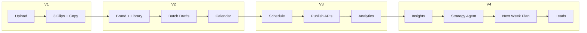
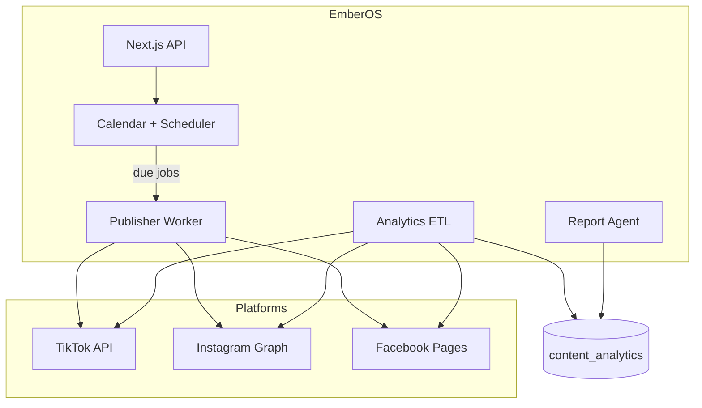
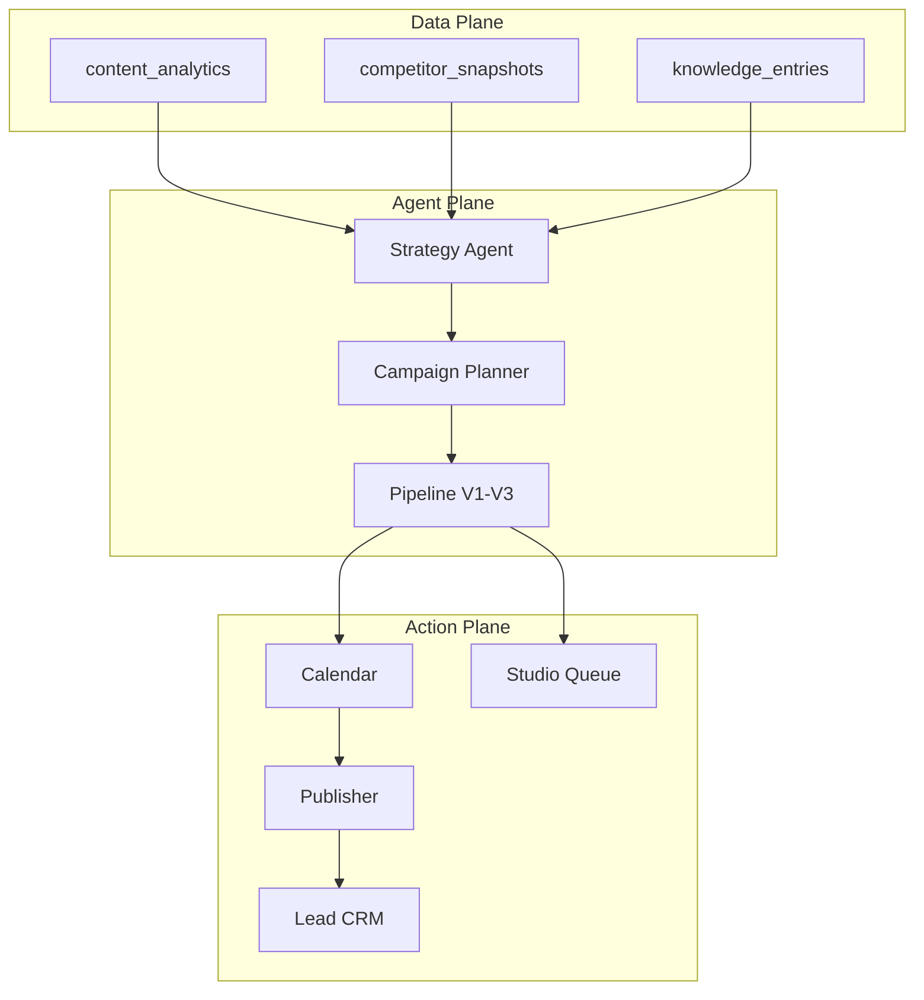

# EmberOS V2–V4 — Architecture Forecast

> **Prerequisite:** [EMBEROS_V1_ARCHITECTURE.md](./EMBEROS_V1_ARCHITECTURE.md)  
> **Principle:** Each version **extends** the prior — no rewrites. V1 `projects → videos → clips` remains the content atom.  
> **Video Studio (Quick Mode plan):** [VIDEO_STUDIO.md](./VIDEO_STUDIO.md)

---

## Version Ladder

```text
V1  Auto Clip        →  解决「剪辑时间」     projects / videos / clips
V2  Content Workspace →  解决「内容生产管理」 workspaces / library / calendar / review
V3  Publishing + Analytics →  解决「发布与效果」 OAuth / scheduler / metrics / reports
V4  Growth Agent + Studio   →  解决「增长决策」 strategy agent / campaigns / leads / studio
```



---

## Cross-Version Domain Model

V1 uses **user-centric** `projects`. V2 re-introduces **workspace** as the brand boundary (maps to existing repo `workspaces`).

```text
organizations (billing, plan)
  └── workspaces (brand / client)          ← V2+
        ├── brand_profiles                 ← V2 (formalize JSON)
        ├── media_assets (library)         ← V2
        ├── projects                       ← V1, now scoped to workspace
        │     └── videos → clips → captions
        ├── content_calendar_items         ← V2
        ├── reviews                        ← V2 (reuse client portal pattern)
        ├── publish_jobs                   ← V3 (exists in repo)
        ├── platform_connections           ← V3
        ├── content_analytics              ← V3 (exists in repo)
        ├── campaigns (growth)             ← V4
        ├── competitor_watches             ← V4
        ├── leads                          ← V4
        └── studio_orders                  ← V4
```

**Isolation rule (unchanged):** `workspace_id` on all business tables; storage paths `{workspace_id}/...`.

---

# V2 — Content Workspace

## Goal

从「一次性工具」变成「内容工作台」：品牌一致、素材复用、排期与审核。

## User Flow

```text
素材上传（库）
  → AI 批量生成多个草稿（clips + copy variants）
  → 用户勾选
  → 加入内容日历
  → 内部/客户审核
  → 下载 / 等待 V3 发布
```

## New / Extended Schema

| Table | Purpose |
|-------|---------|
| `workspaces` | Brand/client boundary (exists — wire to V1 projects) |
| `brand_profiles` | tone, logo URL, colors, banned words, locales |
| `media_assets` | Library: video, image, audio, logo; tags, duration |
| `media_asset_tags` | Faceted search |
| `content_calendar_items` | `clip_id`, `scheduled_at`, `status`, `platform` |
| `draft_batches` | One upload → N draft clip sets |
| `draft_batch_items` | clip candidates before user selection |
| `reviews` | Internal + client (exists — extend to `clips`) |
| `client_invites` | Magic-link scoped review (exists) |

```sql
-- V2 additions (illustrative)
CREATE TYPE calendar_item_status AS ENUM (
  'draft', 'scheduled', 'published', 'skipped'
);

CREATE TABLE brand_profiles (
  workspace_id UUID PRIMARY KEY REFERENCES workspaces(id),
  tone TEXT,
  logo_storage_path TEXT,
  primary_color TEXT,
  banned_words TEXT[],
  locales TEXT[] DEFAULT '{en}',
  settings JSONB DEFAULT '{}'
);

CREATE TABLE media_assets (
  id UUID PRIMARY KEY DEFAULT gen_random_uuid(),
  workspace_id UUID NOT NULL REFERENCES workspaces(id),
  type TEXT NOT NULL,  -- video | image | audio | logo
  storage_path TEXT NOT NULL,
  duration_sec NUMERIC,
  tags TEXT[],
  source TEXT,         -- upload | generated | stock
  created_at TIMESTAMPTZ DEFAULT now()
);

CREATE TABLE content_calendar_items (
  id UUID PRIMARY KEY DEFAULT gen_random_uuid(),
  workspace_id UUID NOT NULL,
  clip_id UUID REFERENCES clips(id),
  platform caption_platform NOT NULL,
  scheduled_at TIMESTAMPTZ,
  status calendar_item_status DEFAULT 'draft',
  review_id UUID REFERENCES reviews(id)
);
```

## New Services

| Service | Role |
|---------|------|
| **Library API** | CRUD media, dedupe by hash, folder/tag search |
| **Batch Generator** | 1 video → M clip sets (e.g. 3×3 = 9 candidates → user picks 3) |
| **Brand Injector** | Logo overlay + color LUT + tone in copy agent prompts |
| **Calendar Service** | Drag-drop slots; conflict detection |
| **Review Service** | State machine: draft → internal → client → approved |

## Job Queues (V2)

| Queue | Job | Notes |
|-------|-----|-------|
| `pipeline` | `video.batch_generate` | Fan-out N analyze passes with different hooks |
| `render` | `ffmpeg.render` | Unchanged |
| `render` | `ffmpeg.brand_overlay` | Logo burn-in from `brand_profiles` |
| `export` | `ffmpeg.export_calendar` | Bulk ZIP for a week |

## Storage (V2)

```text
{workspace_id}/library/{asset_id}/...
{workspace_id}/brand/logo.png
{workspace_id}/calendar/{item_id}/...
```

## API Surface (V2)

```text
/api/workspaces/:id/brand
/api/workspaces/:id/library
/api/workspaces/:id/library/upload-url
/api/workspaces/:id/batches          POST — batch generate
/api/workspaces/:id/calendar
/api/clips/:id/reviews
/api/portal/:token                     — client review (exists)
```

## Repo Reuse

| Existing | V2 use |
|----------|--------|
| `workspaces.brand_profile` JSON | → `brand_profiles` table or keep JSON |
| `campaigns` + multi-asset | → `draft_batches` |
| `reviews` + `client_invites` | → clip-level review |
| `motion-compose` image montage | → library mixed campaigns |

## V2 Non-Goals

- No platform OAuth yet
- No auto-publish
- No competitor tracking

---

# V3 — Publishing + Analytics

## Goal

成为真正的 **Marketing OS**：发得出、看得见效果、能排期。

## User Flow

```text
生成内容 → 审核通过 → 排程 → 自动发布 → 拉取数据 → AI 周报
```

## New / Extended Schema

| Table | Purpose |
|-------|---------|
| `platform_connections` | OAuth tokens per workspace × platform |
| `publish_jobs` | **Exists** — extend for clip_id, retry, external_post_id |
| `publish_schedules` | Cron-like recurrence |
| `content_analytics` | **Exists** — daily metrics per published clip |
| `workspace_insights` | **Exists** — aggregated best time, top content |
| `analytics_sync_jobs` | ETL from platform APIs |

```sql
CREATE TYPE platform_type AS ENUM ('tiktok', 'instagram', 'facebook', 'youtube_shorts');

CREATE TABLE platform_connections (
  id UUID PRIMARY KEY DEFAULT gen_random_uuid(),
  workspace_id UUID NOT NULL REFERENCES workspaces(id),
  platform platform_type NOT NULL,
  access_token_enc TEXT NOT NULL,
  refresh_token_enc TEXT,
  token_expires_at TIMESTAMPTZ,
  external_account_id TEXT,
  scopes TEXT[],
  status TEXT DEFAULT 'active',
  UNIQUE (workspace_id, platform, external_account_id)
);

CREATE TABLE analytics_sync_jobs (
  id UUID PRIMARY KEY DEFAULT gen_random_uuid(),
  workspace_id UUID NOT NULL,
  publish_job_id UUID REFERENCES publish_jobs(id),
  status job_status DEFAULT 'queued',
  last_synced_at TIMESTAMPTZ
);
```

## New Services

| Service | Host | Role |
|---------|------|------|
| **OAuth Broker** | Vercel API | Meta / TikTok OAuth dance, token refresh |
| **Publisher Worker** | Worker or separate `apps/publisher` | Upload video + caption to APIs |
| **Scheduler** | Vercel Cron + Redis delayed jobs | Fire publish at `scheduled_at` |
| **Analytics ETL** | Worker cron (hourly) | Pull insights, normalize to `content_analytics` |
| **Report Agent** | `packages/agents` | Weekly LLM summary → `workspace_insights` |

## Architecture (V3)



## Job Queues (V3)

| Queue | Job |
|-------|-----|
| `publish` | `platform.publish` — upload media + caption |
| `publish` | `platform.refresh_token` |
| `analytics` | `platform.sync_metrics` |
| `agent` | `report.weekly` |

## Publishing State Machine

```text
approved → scheduled → publishing → published → metrics_syncing → done
                              ↓
                           failed → retry (max 3)
```

## API Surface (V3)

```text
GET/POST  /api/workspaces/:id/connections/:platform
DELETE    /api/workspaces/:id/connections/:id
POST      /api/calendar/:itemId/schedule
POST      /api/clips/:id/publish
GET       /api/workspaces/:id/analytics/overview
GET       /api/workspaces/:id/analytics/report?week=2026-W12
GET       /api/workspaces/:id/insights/best-time-to-post
```

## Metrics Model

| Metric | Source | Granularity |
|--------|--------|-------------|
| views, reach, engagement | Platform APIs | Daily per clip |
| best_time_to_post | Aggregated historical | Workspace × platform |
| best_performing_content | Top N by engagement rate | Weekly insight |

## V3 Compliance & Risk

- OAuth token encryption at rest (Supabase Vault or app-level AES)
- Platform ToS: rate limits, re-auth flows
- User must own connected accounts
- Publish audit log (who, when, what clip)

## Repo Reuse

| Existing | V3 use |
|----------|--------|
| `publish_jobs` | Core publish entity |
| `content_analytics` | Metrics store |
| `workspace_insights` | AI weekly report target |
| `packages/agents/publish.ts` | Platform caption formatting |
| `api/creatives/export` | Pre-publish asset pack |

---

# V4 — Growth Agent + Studio

## Goal

从「内容工具」升级为「增长系统」：数据驱动策略、活动规划、线索追踪、高阶制作。

## User Flow

```text
数据分析
  → AI 策略建议（下周发什么）
  → 自动生成内容计划
  → 生成视频/文案/排程（V1–V3 流水线）
  → 追踪留言/私信/WhatsApp 线索
  → （可选）Studio 人工精修订单
```

## New / Extended Schema

| Table | Purpose |
|-------|---------|
| `growth_campaigns` | Thematic campaigns (Q2 launch, wedding season) |
| `campaign_plans` | AI-generated week/month content plan JSON |
| `strategy_sessions` | Agent run log + recommendations |
| `competitor_watches` | Track competitor handles / hashtags |
| `competitor_snapshots` | Periodic scrape/API snapshot |
| `leads` | Comment/DM/WhatsApp captured leads |
| `lead_events` | Funnel stages |
| `broll_credits` | Premium B-roll generation quota |
| `studio_orders` | Human-in-loop premium edits |
| `knowledge_entries` | **Exists** — RAG for strategy + copy |

```sql
CREATE TABLE growth_campaigns (
  id UUID PRIMARY KEY DEFAULT gen_random_uuid(),
  workspace_id UUID NOT NULL,
  name TEXT NOT NULL,
  goal TEXT,
  start_at DATE,
  end_at DATE,
  status TEXT DEFAULT 'planning',
  plan_json JSONB
);

CREATE TABLE competitor_watches (
  id UUID PRIMARY KEY DEFAULT gen_random_uuid(),
  workspace_id UUID NOT NULL,
  platform platform_type NOT NULL,
  handle TEXT NOT NULL,
  last_synced_at TIMESTAMPTZ
);

CREATE TABLE leads (
  id UUID PRIMARY KEY DEFAULT gen_random_uuid(),
  workspace_id UUID NOT NULL,
  source TEXT,           -- comment | dm | whatsapp | form
  platform platform_type,
  external_thread_id TEXT,
  contact_handle TEXT,
  status TEXT DEFAULT 'new',
  clip_id UUID REFERENCES clips(id),
  metadata JSONB
);

CREATE TABLE studio_orders (
  id UUID PRIMARY KEY DEFAULT gen_random_uuid(),
  workspace_id UUID NOT NULL,
  clip_id UUID REFERENCES clips(id),
  brief TEXT,
  status TEXT DEFAULT 'submitted',
  assigned_to UUID,
  deliverable_path TEXT,
  price_cents INTEGER
);
```

## New Services

| Service | Role |
|---------|------|
| **Strategy Agent** | CEO-style orchestrator: reads analytics + competitor data → `campaign_plans` |
| **Campaign Planner** | Decompose plan into calendar items + batch jobs |
| **Competitor Watch** | Scheduled scrape / official APIs where available |
| **Lead Ingest** | Webhooks: Meta inbox, WhatsApp Business API, Zapier |
| **B-roll Engine** | Stock API + Gen-AI clips; debit `broll_credits` |
| **EmberOS Studio** | Internal queue for human editors (SLA, assignment) |

## Architecture (V4)



## Job Queues (V4)

| Queue | Job |
|-------|-----|
| `agent` | `strategy.weekly_plan` |
| `agent` | `competitor.sync` |
| `render` | `ffmpeg.broll_compose` — premium B-roll (credits) |
| `studio` | `studio.assign` / `studio.deliver` |
| `leads` | `lead.ingest` / `lead.notify` |

## API Surface (V4)

```text
POST  /api/workspaces/:id/strategy/run
GET   /api/workspaces/:id/strategy/plan
POST  /api/workspaces/:id/campaigns
GET   /api/workspaces/:id/competitors
POST  /api/workspaces/:id/competitors
GET   /api/workspaces/:id/leads
PATCH /api/leads/:id
POST  /api/studio/orders
GET   /api/credits/broll
```

## Credit / Monetization (V4)

| SKU | Includes |
|-----|----------|
| Free / Starter | V1–V2 core |
| Pro | V3 publish + analytics |
| Agency | Multi-workspace + client portal |
| Studio add-on | Per-order or monthly retainer |
| B-roll credits | Pack of 10 AI B-roll inserts |

---

## Infrastructure Evolution

| Concern | V1 | V2 | V3 | V4 |
|---------|----|----|----|-----|
| **Web** | Vercel | + calendar UI | + OAuth callbacks | + strategy dashboard |
| **Workers** | 1 FFmpeg worker | + batch fan-out | + publisher service | + competitor/lead workers |
| **Redis** | BullMQ | + delayed calendar | + publish retries | + agent scheduling |
| **DB** | Supabase PG | + library tables | + connections | + leads, campaigns |
| **Storage** | 4 buckets | + library | unchanged | + studio deliverables |
| **Search** | — | Postgres FTS | — | pgvector for knowledge RAG |
| **Realtime** | Poll | Supabase Realtime on jobs | Realtime on publish status | Lead notifications |

---

## Security & Multi-Tenancy by Version

| Version | New surface |
|---------|-------------|
| V2 | Client portal tokens; library cross-project access within workspace |
| V3 | OAuth secrets; publish as user — scope minimization |
| V4 | Lead PII; WhatsApp webhooks; Studio assignee RBAC |

RBAC progression:

```text
V1: user owns projects
V2: workspace roles (admin, editor, reviewer, client_viewer) — exists in repo
V3: + publisher role
V4: + studio_editor, growth_analyst
```

---

## Scaling Forecast

| Users | V1 | V2 | V3 | V4 |
|-------|----|----|----|-----|
| 100 | 1 worker | Library CDN | Publisher 2 instances | Agent runs 10/day |
| 1k | 5 workers | Batch queue | Analytics ETL hourly | Lead webhook burst |
| 10k | Shard render queue | Elastic library | Per-platform rate pools | Dedicated agent cluster |

---

## Implementation Timeline (Indicative)

| Phase | Duration | Deliverable |
|-------|----------|-------------|
| **V1** | 12 weeks | Auto clip + credits + export |
| **V2** | +10 weeks | Workspace, library, calendar, review |
| **V3** | +14 weeks | TikTok + IG + FB publish, analytics, weekly report |
| **V4** | +16 weeks | Strategy agent, campaigns, competitors, leads, studio MVP |

Total **~52 weeks** solo with Cursor; parallel team can compress V3/V4.

---

## Migration Path from Current Repo

The existing `ceo-agent` codebase is **front-loaded toward V2–V3**:

| Already built | Target version |
|---------------|----------------|
| Org / Workspace / RBAC | V2 |
| `brand_profile`, reviews, portal | V2 |
| `publish_jobs`, `content_analytics` | V3 |
| `knowledge_entries`, strategy/hook agents | V4 |
| CEO orchestrator | V4 Strategy Agent (simplify for V1) |

**Recommended path:**

1. **V1:** Simplify to `projects/videos/clips`; keep workspace as optional wrapper.
2. **V2:** Re-attach `workspace_id` to projects; promote library + calendar.
3. **V3:** Wire `publish_jobs` to real OAuth; activate analytics ETL.
4. **V4:** Promote CEO agent to `strategy.weekly_plan`; add leads + studio.

---

*Document version: 1.0 · Companion to EMBEROS_V1_ARCHITECTURE.md*
